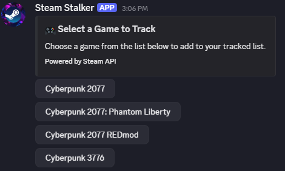
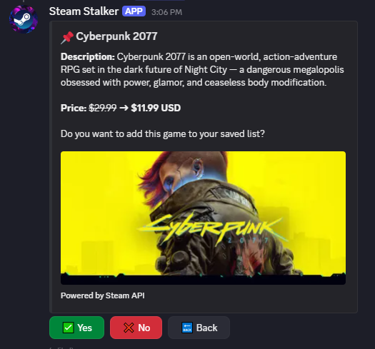
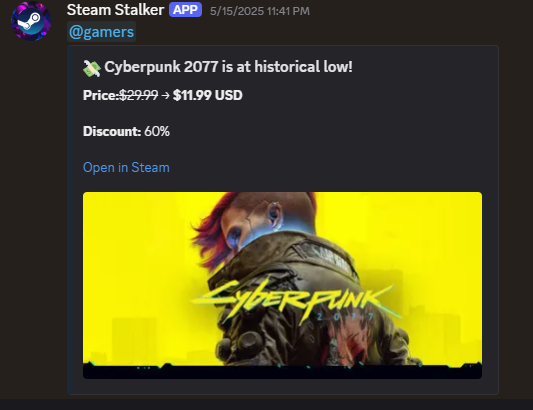

# 🎮 Steam Stalker


**Steam Stalker** is a powerful Discord bot that helps gaming communities track Steam game prices, receive sale alerts, and discover historical low deals — all within your server. Perfect for keeping your server up to date with the hottest discounts and historical lows!

---

## 🔧 Features

- 🔍 **Search Steam Games**
  
  
  
  Quickly search for any Steam game using fuzzy search powered by Fuse.js.

- 💾 **Save Games to Watchlist**

  
  
  Add games to a server-wide tracked list using interactive message components.

- 🛎️ **Sale & Historical Low Alerts**

  
  
  Automatically notifies your server when a saved game goes on sale or hits its historical low price.

- 📅 **Daily Price Monitoring**  
  Uses a scheduled daily check (default: 9 PM) to scan for updates using data from:
  - Steam API
  - IsThereAnyDeal.com

- 📢 **Custom Notification Channels & Roles**  
  Configure which channel to post sale alerts and tag specific roles or @everyone.

- 🧠 **Caching with Redis**  
  Uses Redis (via Aiven) to reduce API calls and speed up searches.

- 💬 **Simple Command System**  
  Cleanly organized slash commands with descriptions and feedback.

---

## 📦 Commands

| Command         | Description                                      |
|-----------------|--------------------------------------------------|
| `/addgame`       | Search and add Steam games by name                   |
| `/addgamebylink`         | Search and add Steam games by steam link          |
| `/removegame`       | Remove a game from the watchlist                 |
| `/showlist`         | View all saved games in your server              |
| `/historicallow`         | View historical low price and discount of any game             |
| `/setchannel`   | Set the channel to receive sale notifications    |
| `/setrole`      | Set a role to be pinged on sale alerts           |
| `/help`         | View all available commands                      |

---

## ⚙️ Setup

### 1. Clone the Repo

```bash
git clone https://github.com/your-username/steam-stalker.git
cd steam-stalker
```
### 2. Set env file & Install dependencies
```bash
TOKEN="TOKEN RECEIVED FROM DISCORD DEVELOPER PORTAL"
APPID="DISCORD APP ID FROM PORTAL"
GUILDID="YOUR GUILD ID, ONLY NEEDED IF YOU WANT TO TEST IT OUT LOCALLY"
PORT="SPECIFY PORT NUMBER"

REDIS_URL="URL OF HOSTED OR LOCAL REDIS INSTANCE"
MONGO_URI="MONGODB CONNECTION URL"

ISTHEREANYDEAL_APIKEY="API KEY OBTAINED FROM ISTHEREANYDEAL"
```

```bash
npm install
npm run dev
```

## 🧠 Tech Stack

- [Discord.js v14](https://discord.js.org) – Discord bot framework
- [MongoDB](https://www.mongodb.com/) – NoSQL database
- [Mongoose](https://mongoosejs.com/) – MongoDB ODM for Node.js
- [Redis (Upstash)](https://upstash.com/) – Caching and rate-limiting store
- [Fuse.js](https://fusejs.io/) – Lightweight fuzzy search library
- [Axios](https://axios-http.com/) – HTTP client for API requests
- [cron-job.org](https://console.cron-job.org/dashboard) – Scheduled task runner

## 🛡️ Permissions Required

When adding the bot to your server, ensure it has the following permissions:

- ✅ Read/Send Messages  
- ✅ Embed Links  
- ✅ Manage Roles (if using role mentions)  
- ✅ Use Slash Commands  

## 📈 Future improvements

- [ ] User-specific watchlists  
- [ ] Game genre/category filters  
- [ ] Steam wishlist sync  
- [ ] Multi-language support  
- [ ] Graphical price history display

## 💬 Contact

For bugs, feedback, or just to say hi – feel free to open an issue or email me at [rhidwwanrashid@iut-dhaka.edu](mailto:rhidwwanrashid@iut-dhaka.edu)!


